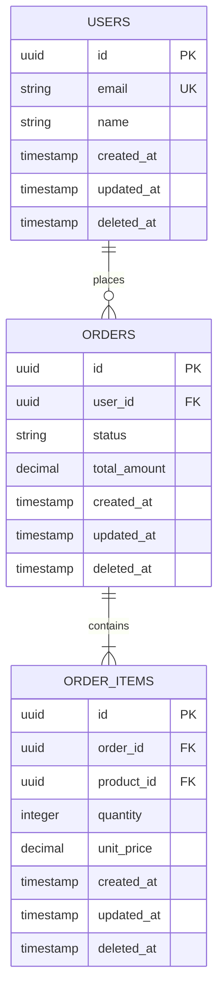

# Create Data Model

## Overview

Design a production-ready data model from feature requirements, including entity definitions, relationships, a Mermaid ERD, index recommendations, and migration safety analysis. The output encodes senior-level database design practices: timestamps on every table, soft deletes, audit trails, and safe migration strategies.

## Workflow

1. **Read project context** -- Read `.chalk/docs/engineering/` for:
   - Existing data model documents to understand current schema and naming conventions
   - Architecture docs for database technology (PostgreSQL, MySQL, MongoDB, etc.)
   - ADRs or RFCs related to data storage decisions
   - If no docs exist, scan the codebase for migration files, model definitions, or schema files to infer conventions

2. **Scan existing schema** -- Use Grep to find:
   - Migration files or schema definitions to understand current tables and naming patterns
   - ORM model definitions (ActiveRecord, SQLAlchemy, Prisma, TypeORM, Drizzle, etc.)
   - Column naming conventions (snake_case, camelCase)
   - Existing timestamp patterns (`created_at`/`updated_at` vs. `createdAt`/`updatedAt`)
   - Soft delete patterns (e.g., `deleted_at`, `is_deleted`)
   - ID strategy (auto-increment, UUID, ULID, prefixed IDs)

3. **Determine the next document number** -- List files in `.chalk/docs/engineering/` matching `*_data_model_*.md`. Find the highest number and increment by 1.

4. **Clarify the domain** -- From `$ARGUMENTS` and conversation context, identify:
   - The entities to model and their real-world meaning
   - The relationships between entities (one-to-one, one-to-many, many-to-many)
   - The key queries this model must support efficiently
   - Expected data volume and growth rate (this drives index and partitioning decisions)
   - Ask the user for clarification if entity boundaries are unclear

5. **Design the entities** -- For each entity, define:
   - Table name (plural, snake_case -- or match project convention)
   - All columns with types, constraints, and defaults
   - Primary key strategy (match existing convention)
   - Required standard columns (see Mandatory Columns below)
   - Foreign keys with appropriate ON DELETE behavior

6. **Design relationships** -- Map all relationships:
   - One-to-many: foreign key on the "many" side
   - Many-to-many: explicit join table with its own timestamps and potential payload columns
   - One-to-one: foreign key with unique constraint -- decide which side owns the FK
   - Polymorphic associations: prefer separate FKs over `type`/`id` pattern when possible

7. **Create the ERD** -- Generate a Mermaid ERD diagram showing all entities, their key columns, and relationships.

8. **Recommend indexes** -- Based on the expected query patterns, recommend:
   - Primary key indexes (automatic)
   - Foreign key indexes (always)
   - Composite indexes for common query combinations
   - Partial indexes for filtered queries (e.g., `WHERE deleted_at IS NULL`)
   - Unique indexes for business-level uniqueness constraints

9. **Analyze migration safety** -- For each schema change, evaluate:
   - Will this lock a table during migration? (ALTER TABLE on large tables)
   - Is the migration reversible?
   - Does it require a data backfill?
   - Can it be deployed without downtime?

10. **Write the document** -- Save to `.chalk/docs/engineering/<n>_data_model_<domain_slug>.md`.

11. **Confirm** -- Tell the user the data model was created with its path, a list of entities, and any migration safety concerns.

## Filename Convention

```
<number>_data_model_<snake_case_domain>.md
```

Examples:
- `6_data_model_user_billing.md`
- `10_data_model_content_management.md`
- `15_data_model_notification_system.md`

## Mandatory Columns

Every table must include these columns unless there is a documented reason to omit them:

| Column | Type | Purpose |
|--------|------|---------|
| `id` | Project convention (UUID/ULID/prefixed) | Primary key |
| `created_at` | `TIMESTAMP WITH TIME ZONE` | Row creation time, set by DB default `NOW()` |
| `updated_at` | `TIMESTAMP WITH TIME ZONE` | Last modification time, updated by trigger or application |
| `deleted_at` | `TIMESTAMP WITH TIME ZONE`, nullable | Soft delete marker; `NULL` means active |

### Why Soft Deletes

Hard deletes cause:
- Data loss that cannot be recovered without backups
- Broken foreign key references or dangling orphans
- Inability to audit what was deleted and when
- Customer support cannot investigate deleted records

Use `deleted_at IS NULL` in application queries (or a default scope/view). Periodically archive or purge soft-deleted records older than a retention threshold.

### When to Skip Soft Deletes

- High-volume transient data (logs, events, metrics) where retention is managed by TTL
- Join tables where the relationship itself has no independent identity
- Document this exemption in the data model

## Data Model Document Format

```markdown
# Data Model: <Domain Name>

Last updated: <YYYY-MM-DD>

## Overview

<1-2 sentences describing the domain and its purpose.>

## Entity Relationship Diagram



## Entity Definitions

### users

<Purpose of this entity.>

| Column | Type | Constraints | Default | Description |
|--------|------|------------|---------|-------------|
| `id` | `UUID` | `PK` | `gen_random_uuid()` | Unique identifier |
| `email` | `VARCHAR(255)` | `NOT NULL, UNIQUE` | — | Login email, case-insensitive |
| `name` | `VARCHAR(255)` | `NOT NULL` | — | Display name |
| `created_at` | `TIMESTAMPTZ` | `NOT NULL` | `NOW()` | Row creation time |
| `updated_at` | `TIMESTAMPTZ` | `NOT NULL` | `NOW()` | Last modification |
| `deleted_at` | `TIMESTAMPTZ` | — | `NULL` | Soft delete marker |

### orders

...

## Relationships

| Relationship | Type | FK Column | ON DELETE | Notes |
|-------------|------|-----------|-----------|-------|
| users -> orders | One-to-many | `orders.user_id` | `RESTRICT` | User cannot be deleted with active orders |
| orders -> order_items | One-to-many | `order_items.order_id` | `CASCADE` | Items deleted with order |

## Indexes

| Table | Index | Columns | Type | Rationale |
|-------|-------|---------|------|-----------|
| `users` | `idx_users_email` | `email` | Unique | Login lookup |
| `orders` | `idx_orders_user_id` | `user_id` | B-tree | List orders by user |
| `orders` | `idx_orders_status_created` | `status, created_at` | Composite | Filter by status + sort by date |
| `orders` | `idx_orders_active` | `id` WHERE `deleted_at IS NULL` | Partial | Exclude soft-deleted from queries |

## Query Patterns

<List the primary queries this model supports and which indexes serve them.>

| Query | Used By | Index | Notes |
|-------|---------|-------|-------|
| Get user by email | Auth service | `idx_users_email` | — |
| List user's orders by date | User dashboard | `idx_orders_user_id` + `idx_orders_status_created` | — |

## Migration Safety Analysis

| Operation | Table Size Risk | Locking | Safe Alternative | Downtime |
|-----------|---------------|---------|-----------------|----------|
| Create `orders` table | N/A (new) | No lock | — | None |
| Add `status` column to `users` | Large table | Brief lock | Add with DEFAULT, no NOT NULL initially | None |
| Add index on `orders.user_id` | Medium table | Locks writes | `CREATE INDEX CONCURRENTLY` | None |

## Audit Trail

<If the domain requires audit logging, describe the strategy.>

| What is Audited | How | Retention |
|----------------|-----|-----------|
| Order status changes | `order_status_history` table | 2 years |
| User profile updates | `audit_log` table with before/after JSON | 1 year |
```

## Index Design Rules

1. **Always index foreign keys** -- Every FK column gets a B-tree index. Without it, JOINs and cascade deletes cause full table scans.
2. **Composite indexes: most selective column first** -- Put the column with highest cardinality first in the index definition.
3. **Partial indexes for soft deletes** -- `CREATE INDEX idx_active ON table(id) WHERE deleted_at IS NULL` avoids indexing deleted rows.
4. **Do not over-index** -- Each index slows writes. Only create indexes for proven query patterns, not speculative ones.
5. **Unique indexes for business constraints** -- If `(user_id, email)` must be unique, enforce it at the database level, not just the application.

## ON DELETE Strategy

| Relationship Type | Recommended ON DELETE | Rationale |
|------------------|----------------------|-----------|
| Parent-child (lifecycle dependency) | `CASCADE` | Child has no meaning without parent |
| Reference (independent entities) | `RESTRICT` | Prevent orphaning; force explicit cleanup |
| Optional reference | `SET NULL` | FK becomes NULL; referenced entity is independent |
| Audit/history records | `RESTRICT` | Never delete audit trail |

## Migration Safety Rules

Large table operations (>1M rows) require special handling:

| Operation | Risk | Safe Alternative |
|-----------|------|-----------------|
| `ALTER TABLE ADD COLUMN NOT NULL` | Rewrites table, locks | Add nullable, backfill, then add NOT NULL constraint |
| `ALTER TABLE ADD COLUMN DEFAULT` | PostgreSQL 11+ is safe; older versions rewrite | Check DB version first |
| `CREATE INDEX` | Locks writes | `CREATE INDEX CONCURRENTLY` |
| `ALTER TABLE DROP COLUMN` | Quick but irreversible | Rename to `_deprecated_<name>`, drop later |
| `ALTER TABLE ALTER TYPE` | Full table rewrite | Add new column, backfill, swap |
| `ALTER TABLE ADD CONSTRAINT FK` | Scans entire table | Add with `NOT VALID`, validate separately |

## Anti-patterns

- **No indexes on foreign keys** -- Every foreign key column must have an index. Without it, JOINs degrade to O(n) scans and cascade deletes lock the table. This is the most common and most damaging data model mistake.
- **No timestamps** -- Every table needs `created_at` and `updated_at`. Without them, debugging, auditing, and data analysis are impossible. There is no "we don't need timestamps" -- you always do.
- **Hard deletes** -- Using `DELETE FROM` destroys data permanently. Use soft deletes (`deleted_at`) for all user-facing data. Only use hard deletes for transient, high-volume data where retention is managed separately.
- **Nullable foreign keys without documented reason** -- A nullable FK means the relationship is optional. This must be an intentional design choice, not a default. Document why the relationship can be absent.
- **No migration safety review** -- Adding a NOT NULL column to a table with 10M rows will lock the table for minutes. Every migration must be reviewed for locking behavior, especially on large tables.
- **Storing derived data without a refresh strategy** -- Denormalized columns (e.g., `order_count` on users) are fine for performance, but you must document how and when they are refreshed. Stale denormalized data is worse than no denormalization.
- **Using ENUMs in the database** -- Database-level ENUMs are hard to modify (ALTER TYPE requires careful handling). Use VARCHAR with application-level validation, or a reference/lookup table.
- **Missing unique constraints for business rules** -- If an email must be unique per organization, enforce it with a unique index `(org_id, email)`, not just application code. Application bugs bypass code checks; database constraints do not.
