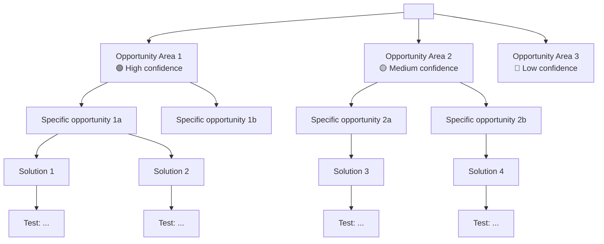

# Create Opportunity Solution Tree

## Overview

Generate an Opportunity Solution Tree (Teresa Torres, Continuous Discovery Habits) that connects a desired outcome to the customer opportunities that could drive it, the solutions that could address each opportunity, and the assumption tests that validate each solution. The OST makes the team's thinking visible and ensures every solution is traceable back to a real customer need and forward to a concrete experiment. Output includes a Mermaid diagram for visual communication.

## Workflow

1. **Read product context** — Load `.chalk/docs/product/0_product_profile.md`, research syntheses, JTBD canvases, and any prior OSTs. Research syntheses and JTBD canvases are the primary inputs for the opportunity space — they contain validated customer needs. If no research exists, note that the OST is hypothesis-based and needs validation.

2. **Define the desired outcome** — Parse `$ARGUMENTS` to identify the target outcome. A valid outcome is:
   - A **product or business metric** (e.g., "increase activation rate from 30% to 50%", "reduce time-to-first-value below 5 minutes")
   - NOT a feature ("build notifications") or an output ("ship v2")
   - If the user provides a feature or output, reframe it: "What metric would improve if we shipped this? Let's use that as the outcome."
   - If the outcome is vague, ask: "What metric are you trying to move? What is the current value and target value?"

3. **Map the opportunity space** — Identify customer needs, pain points, and desires that, if addressed, would drive the outcome. Structure opportunities hierarchically:
   - **Level 1**: broad opportunity areas (3-5 top-level branches)
   - **Level 2**: specific opportunities within each area (2-4 per branch)
   - **Level 3** (if needed): sub-opportunities for particularly rich areas

   For each opportunity:
   - Write it as a customer need or pain point, not a solution
   - Assign a confidence level: high (validated by research), medium (mentioned in research but not deeply explored), low (hypothesis)
   - Reference the source (research synthesis theme, JTBD statement, or "hypothesis")

4. **Generate solutions** — For each leaf-level opportunity, brainstorm 2-3 solution ideas. Solutions should:
   - Be concrete enough to evaluate but not over-specified
   - Vary in scope/ambition (at least one lightweight option)
   - Not all be the obvious first idea — push for creative alternatives
   - Each include a one-sentence description of the approach

5. **Define assumption tests** — For each solution, identify the riskiest assumption and design one experiment to test it:
   - **Assumption**: what must be true for this solution to work
   - **Test type**: prototype test, fake door, survey, data analysis, concierge test, Wizard of Oz, A/B test, or other
   - **Success criteria**: what result would validate the assumption (be specific and quantitative where possible)
   - **Effort**: S (< 1 day), M (1-3 days), L (3-5 days)

6. **Render Mermaid diagram** — Create a Mermaid tree diagram showing the full OST. Use color coding or markers for confidence levels. The diagram should be readable at the team level — not every detail needs to be in the diagram, but the structure must be clear.

7. **Determine the next file number** — Read filenames in `.chalk/docs/product/` to find the highest numbered file. The next number is `highest + 1`.

8. **Write the file** — Save to `.chalk/docs/product/<n>_ost_<outcome_slug>.md`.

9. **Confirm** — Tell the user the OST was created, share the file path, highlight the highest-confidence opportunities, and call out which assumption tests should be run first (prioritize by risk and effort).

## OST Structure

```markdown
# Opportunity Solution Tree: <Desired Outcome>

Last updated: <YYYY-MM-DD> (Initial draft)

## Desired Outcome

**Metric**: <specific metric name>
**Current value**: <baseline>
**Target value**: <goal>
**Timeframe**: <by when>

Evidence base: <list source docs or "Hypothesis-based — needs validation">

## Tree Diagram



## Opportunity Space

### Opportunity Area 1: <Area Name>

**Confidence**: high/medium/low | **Source**: <research doc or "hypothesis">

#### Opportunity 1a: <Specific Opportunity>

<1-2 sentence description of the customer need or pain point>

**Confidence**: high/medium/low | **Source**: <specific theme, JTBD, or quote>

**Solutions**:

| # | Solution | Description | Riskiest Assumption |
|---|----------|-------------|---------------------|
| S1 | ... | ... | ... |
| S2 | ... | ... | ... |
| S3 | ... | ... | ... |

**Assumption Tests**:

| # | For Solution | Assumption | Test Type | Success Criteria | Effort |
|---|-------------|------------|-----------|------------------|--------|
| T1 | S1 | ... | prototype test | ... | S |
| T2 | S2 | ... | fake door | ... | M |

#### Opportunity 1b: <Specific Opportunity>

...

### Opportunity Area 2: <Area Name>

...

## Recommended Next Steps

1. **Run first**: <highest priority test — low effort, high risk reduction>
2. **Run second**: <next priority test>
3. **Needs more research**: <opportunities with low confidence that need discovery before solutioning>

## Assumptions Log

| # | Assumption | Status | Test | Result |
|---|-----------|--------|------|--------|
| A1 | ... | untested | T1 | — |
| A2 | ... | untested | T2 | — |
```

## Output

- **File**: `.chalk/docs/product/<n>_ost_<outcome_slug>.md`
- **Format**: Plain markdown, no YAML frontmatter
- **First line**: `# Opportunity Solution Tree: <Desired Outcome>`
- **Second line**: `Last updated: <YYYY-MM-DD> (Initial draft)`

## Anti-patterns

- **Jumping straight to solutions** — The most common OST failure is starting with solutions and working backward to justify them. The tree must be built top-down: outcome first, then opportunities, then solutions. If you already know the solution, you are doing feature development, not discovery.
- **Single-branch trees** — An OST with one opportunity area and one solution per opportunity is not a tree — it is a plan that looks like a tree. Real discovery requires exploring multiple opportunity areas and generating multiple solution options. If every branch has only one child, push for alternatives.
- **No experiments tied to assumptions** — Solutions without assumption tests are bets without validation. Every solution must have at least one experiment. If you cannot think of an experiment, you have not identified the riskiest assumption clearly enough.
- **Confusing outputs with outcomes** — "Ship feature X" is an output. "Increase activation rate" is an outcome. The root of the tree must be a measurable change in user or business behavior, not a deliverable. If the root is a feature, reframe it as the metric that feature is supposed to move.
- **Opportunities written as solutions** — "Add a search bar" is a solution, not an opportunity. "Users cannot find the item they need in a list of 200+ items" is an opportunity. Opportunities describe customer problems. Solutions describe product responses.
- **All low-confidence nodes with no validation plan** — A hypothesis-heavy tree is fine as a starting point, but it must include a plan for validating those hypotheses. Flag low-confidence opportunities and prioritize research on them before investing in solutions.
- **Ignoring existing research** — If research syntheses and JTBD canvases exist in `.chalk/docs/product/`, they should directly populate the opportunity space. Building an OST from scratch when validated research exists wastes the team's prior work.
- **Experiments that are too expensive** — Early assumption tests should be small (S or M effort). If every experiment is an L, the team will run zero experiments and just build the thing. Start with the cheapest possible test that reduces the riskiest assumption.
