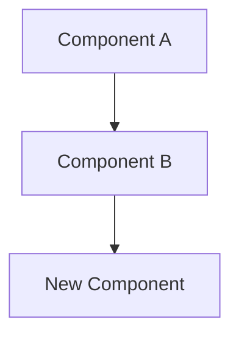

# Create RFC

## Overview

Create a structured Request for Comments (RFC) document for significant technical proposals that require cross-team review and consensus. RFCs are heavier than ADRs -- they are appropriate when a proposal affects multiple teams, introduces new infrastructure, changes a core abstraction, or has a blast radius that demands structured feedback before commitment.

## Workflow

1. **Read project context** -- Read `.chalk/docs/engineering/` for existing architecture docs, ADRs, and prior RFCs. Understand the current system state so the proposal builds on established decisions rather than contradicting them.

2. **Determine the next RFC number** -- List files in `.chalk/docs/engineering/` matching the pattern `*_rfc_*.md`. Find the highest number and increment by 1. If no RFCs exist, start at `1`.

3. **Clarify the proposal scope** -- From `$ARGUMENTS` and conversation context, identify:
   - The specific technical change being proposed
   - The problem or opportunity motivating it (why now, not six months ago or six months from now)
   - The teams and systems affected
   - Whether this is the right size for an RFC (if it is a single-team decision with limited blast radius, suggest an ADR instead)
   - Ask the user for clarification if the scope is ambiguous or too broad

4. **Research the design space** -- Before writing, investigate:
   - Existing patterns in the codebase that the proposal interacts with
   - Prior art in `.chalk/docs/engineering/` that constrains or informs the design
   - At least 2 alternative approaches to the proposed solution
   - Known risks, failure modes, and operational concerns

5. **Draft the RFC** -- Write the full RFC using the format below. Be concrete and opinionated. An RFC that hedges on every decision is not useful -- take a position and defend it, while honestly documenting the tradeoffs.

6. **Include a review plan** -- Specify who should review, what feedback is needed, and a recommended review period. Default to 5 business days for standard proposals and 10 business days for proposals affecting core infrastructure.

7. **Write the file** -- Save to `.chalk/docs/engineering/<n>_rfc_<proposal_slug>.md`.

8. **Confirm** -- Tell the user the RFC was created with its path, a one-sentence summary of the proposal, and the recommended review timeline.

## Filename Convention

```
<number>_rfc_<snake_case_proposal>.md
```

Examples:
- `5_rfc_migrate_to_event_driven_architecture.md`
- `9_rfc_unified_authentication_service.md`
- `14_rfc_adopt_feature_flags_platform.md`

## RFC Format

```markdown
# RFC-<number>: <Proposal Title>

Last updated: <YYYY-MM-DD>

## Status

<Draft | In Review | Accepted | Rejected | Withdrawn | Superseded by [RFC-X](link)>

## Review Period

- **Opens**: <YYYY-MM-DD>
- **Closes**: <YYYY-MM-DD>
- **Decision method**: <Consensus | Designated approver(s) | Lazy consensus with timeout>
- **Required reviewers**: <list of teams or individuals who must weigh in>

## Summary

<2-3 sentence executive summary. A busy engineer should understand the proposal from this alone. State what you want to do and the single most important reason why.>

## Motivation

### Problem Statement

<What specific, concrete problem does this solve? Include data, user complaints, incident reports, or developer experience pain points. Quantify the cost of inaction.>

### Why Now

<What has changed that makes this the right time? A new constraint, a growth threshold, a dependency EOL, an upcoming project that will be blocked without this? "Tech debt" is not sufficient motivation -- explain the interest rate.>

### Goals and Non-Goals

**Goals:**
- <Specific, measurable outcome 1>
- <Specific, measurable outcome 2>

**Non-Goals (explicitly out of scope):**
- <Thing that might seem related but is not part of this proposal>
- <Thing that is a future phase, not this RFC>

## Detailed Design

### Architecture Overview

<Describe the proposed architecture. Include a Mermaid diagram for system-level changes.>



### Key Design Decisions

<For each significant design choice within the proposal, explain what you chose and why. These are the sub-decisions within the RFC that reviewers should scrutinize.>

#### Decision 1: <title>

<Explanation with rationale>

#### Decision 2: <title>

<Explanation with rationale>

### API / Interface Changes

<If applicable, show the new interfaces, API endpoints, configuration format, or contract changes. Use concrete code examples, not pseudocode.>

### Data Model Changes

<If applicable, describe schema changes, migration strategy, and data backfill plan.>

### Migration Strategy

<How do we get from the current state to the proposed state? Is it a big-bang migration or incremental? What is the rollback plan? How long will the old and new systems coexist?>

### Operational Considerations

- **Monitoring**: <What new metrics, alerts, or dashboards are needed?>
- **Rollout plan**: <Feature flags, canary deployment, percentage rollout?>
- **Rollback plan**: <How to revert if the change causes problems in production?>
- **Performance impact**: <Expected impact on latency, throughput, resource usage>

## Drawbacks

<Be honest. Why might we NOT want to do this? List at least 2 genuine drawbacks. Reviewers will trust this RFC more if it acknowledges its own weaknesses.>

- <Drawback 1 with explanation of severity and mitigation>
- <Drawback 2 with explanation of severity and mitigation>

## Alternatives Considered

### Alternative 1: <title>

<Description of the alternative approach.>

**Pros**: <list>
**Cons**: <list>
**Why not chosen**: <specific, honest reason>

### Alternative 2: <title>

<Description of the alternative approach.>

**Pros**: <list>
**Cons**: <list>
**Why not chosen**: <specific, honest reason>

### Do Nothing

<What happens if we do not implement this proposal? This is always a valid alternative. Describe the cost of inaction concretely.>

## Unresolved Questions

<Questions that should be answered during the review period. These are not gaps in your thinking -- they are decisions that benefit from group input.>

1. <Question 1 — provide your current leaning and why>
2. <Question 2 — provide your current leaning and why>
3. <Question 3 — provide your current leaning and why>

## Future Possibilities

<What does this unlock that we are explicitly NOT doing now? This helps reviewers understand the long-term vision without conflating it with the current proposal.>

- <Future possibility 1>
- <Future possibility 2>

## References

- <Link to related ADRs, prior RFCs, external resources, or research>
```

## When to Write an RFC vs. an ADR

| Signal | RFC | ADR |
|--------|-----|-----|
| Affects multiple teams | Yes | No |
| Introduces new infrastructure component | Yes | No |
| Changes a core abstraction or API contract | Yes | Maybe |
| Requires migration of existing systems | Yes | Maybe |
| Single-team implementation decision | No | Yes |
| Choice between known libraries/tools | No | Yes |
| Needs structured review period with deadlines | Yes | No |

If in doubt, start with an ADR. If reviewers say "this needs more discussion," upgrade to an RFC.

## Review Period Guidelines

| Proposal Scope | Recommended Period | Decision Method |
|---------------|-------------------|-----------------|
| Team-level infrastructure change | 3-5 business days | Team lead approval |
| Cross-team API or data model change | 5-7 business days | Consensus among affected teams |
| Core infrastructure or platform change | 7-10 business days | Architecture review + designated approver |
| Organization-wide process change | 10+ business days | Lazy consensus with explicit timeout |

## Writing Quality Rules

- **Summary**: A VP should be able to read only the Summary and understand what is being proposed. No jargon without definition.
- **Motivation**: Lead with the problem, not the solution. If you cannot articulate the problem without referencing your solution, you do not understand the problem well enough.
- **Detailed Design**: Concrete enough that another engineer could implement it without further design sessions. Use real names, real types, real examples.
- **Drawbacks**: If you cannot name at least 2 drawbacks, you have not thought hard enough. Every design has tradeoffs.
- **Unresolved Questions**: Always include your current leaning. "I don't know" without a leaning shifts the burden entirely to reviewers.

## Anti-patterns

- **RFC for a trivial decision** -- If the change affects only one team and has an obvious answer, use an ADR. RFCs have high coordination cost; reserve them for decisions that genuinely need cross-team input.
- **No Drawbacks section** -- An RFC that claims no drawbacks is either dishonest or insufficiently analyzed. Every proposal has costs. Name them.
- **Mixing multiple proposals** -- One RFC, one proposal. If your RFC has two independent design decisions that could be evaluated separately, split them. Bundling reduces the quality of feedback on each.
- **No Unresolved Questions** -- If you have zero unresolved questions, either you are omniscient or you have not thought carefully enough about edge cases. Include at least 2 genuine questions with your current leaning.
- **Solution-first motivation** -- "We need to adopt X because X is great" is not motivation. Start with the problem, then show why X solves it better than alternatives.
- **Infinite review period** -- RFCs without a deadline never get decided. Always set a close date and decision method. If consensus is not reached by the deadline, the designated approver decides.
- **Design by committee in the doc** -- The RFC author proposes a concrete design. Reviewers critique it. The RFC is not a brainstorming space -- it is a proposal with a position.
- **No migration strategy** -- Proposing a new system without explaining how to get there from the current state is an incomplete proposal. Include the transition plan.
